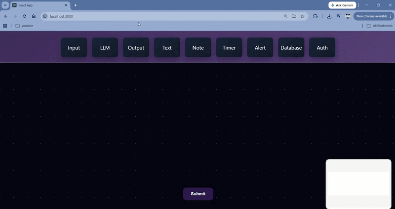

# Pipeline Builder

A visual workflow editor for designing and validating data pipelines through a drag-and-drop interface. Built to catch configuration errors — like circular dependencies — before they ever reach runtime.





**[Live Demo →](https://pipeline-builder-9w7z.vercel.app/)**

> Note: the backend is hosted on Render's free tier, so the first request after a period of inactivity may take 20-30 seconds to wake up. Subsequent requests are fast.

---

## Overview

Pipeline Builder lets you visually construct Directed Acyclic Graph (DAG) workflows by connecting different processing nodes on a canvas. As you build, the backend validates the structure in real time — most importantly, detecting circular dependencies that would otherwise cause the pipeline to fail (or infinite-loop) at runtime.

The core problem this solves: workflow tools that let you wire anything to anything will happily let you create a loop. This one won't.

## Features

### Visual Editor
- Five node types: **Input**, **Output**, **Text**, **LLM**, and **Note**
- Drag-and-drop canvas built on React Flow
- Real-time connection validation as you build

### Smart Text Nodes
- Automatically detects variable placeholders in node content (e.g. `{{variable_name}}`)
- Dynamically generates new input handles on the node as variables are typed
- Auto-resizes based on content length

### Pipeline Validation
- Full DAG validation — detects circular dependencies before submission
- Reports node and edge counts
- Immediate, specific feedback on what's invalid and why

## Tech Stack

**Frontend**
- React + [React Flow](https://reactflow.dev/) for the node-based visual editor
- Zustand for state management
- Deployed on Vercel

**Backend**
- FastAPI (Python)
- Custom DAG validation algorithm (DFS-based cycle detection)
- RESTful API for pipeline analysis
- Deployed on Render

## Running Locally

**Backend**
```bash
cd backend
pip install fastapi uvicorn
python -m uvicorn main:app --reload
```
Runs at `http://localhost:8000`

**Frontend**
```bash
cd frontend
npm install
npm start
```
Runs at `http://localhost:3000`

### Testing DAG Validation Manually

1. Add a Text node and type `{{test}}` — this generates a new input handle on the node
2. Add an LLM node
3. Connect: Text (output) → LLM (input)
4. Connect: LLM (output) → Text (input) — this creates a cycle
5. Submit the pipeline

You should see an explicit error indicating a circular dependency was detected, rather than the pipeline silently accepting an invalid structure.

## Technical Challenges

**Dynamic handle generation caused stale state.** When a Text node's content changed, new variable handles needed to appear immediately — but the initial implementation lagged behind the actual content, leaving handles out of sync with what the user had typed. This was resolved with a `useEffect` hook that watches the text input and triggers handle regeneration whenever variables are added or removed, keeping the node's handles consistent with its content at all times.

**DAG cycle detection needed to be correct, not just present.** Rather than reaching for a library, I implemented depth-first search with an explicit recursion stack to detect back edges in the graph. The key detail is distinguishing between a node that's simply been *visited* versus a node that's currently *on the active recursion path* — only a back edge to a node on the current path indicates a true cycle. Conflating the two would produce false positives on any graph with a node that has multiple incoming edges but no actual loop.

## Possible Extensions

- Persist pipelines to a database instead of validating in-memory per request
- Support pipeline execution, not just structural validation
- Add undo/redo and pipeline versioning
- Export/import pipelines as JSON
